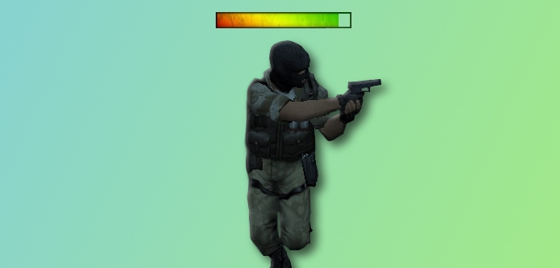
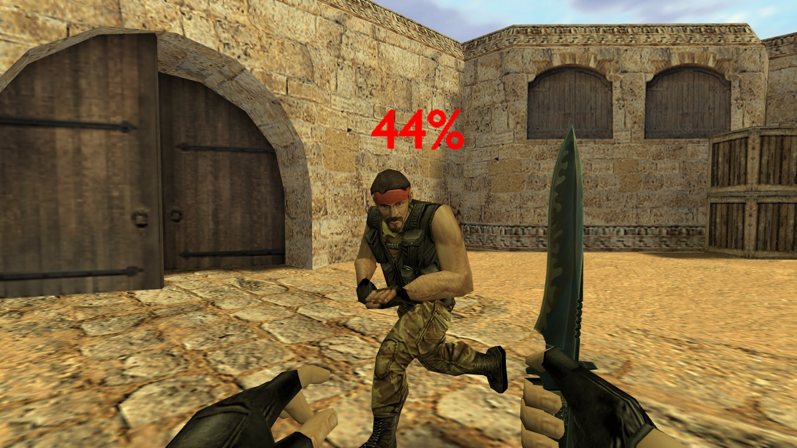

# Lifebar

_**English** | [Русский](README.ru.md)_



AMX Mod X plugin for Counter-Strike.

The plugin adds a health bar above the players.

## Configuration
### Cvars
- ```lifebar_team "0"``` Lifebar is displayed above all players, 1 — only above allies, 2 — only above enemies.
- ```lifebar_alive "0"``` Lifebar is displayed in any state of the player, 1 — only alive, 2 — only dead.
- ```lifebar_max_health "100"``` Maximum player health for 100% lifebar state.

### Definitions
The configuration is done in the source file:
```c
// #define COLORED_LIFEBAR // Use a colored lifebar (uncomment for color support)
#define COLOR_RED Float: { 255.0, 0.0, 0.0 } // Lifebar color for the terrorist team
#define COLOR_BLUE Float: { 0.0, 0.0, 255.0 } // Lifebar color for the counter-terrorist team
#define LIFEBAR_RENDERMODE kRenderTransTexture
#define LIFEBAR_RENDERAMT 255.0
#define LIFEBAR_SCALE 0.2 // Lifebar size

// Lifebar model (sprites/next21_efk/lifebar_numeric.spr for numeric)
new const MODELS_LIFEBAR[2][] = {
	"sprites/next21_efk/lifebar_def.spr", // for the terrorist team
	"sprites/next21_efk/lifebar_def.spr" // for the counter-terrorist team
}
```



## Authors
- [Psycrow](https://github.com/Psycrow101)
